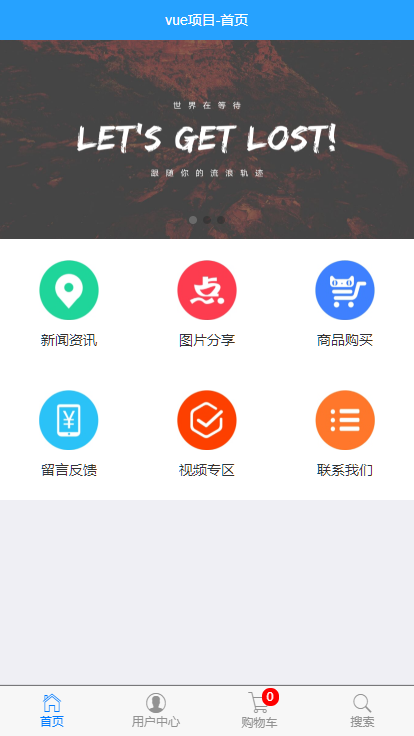
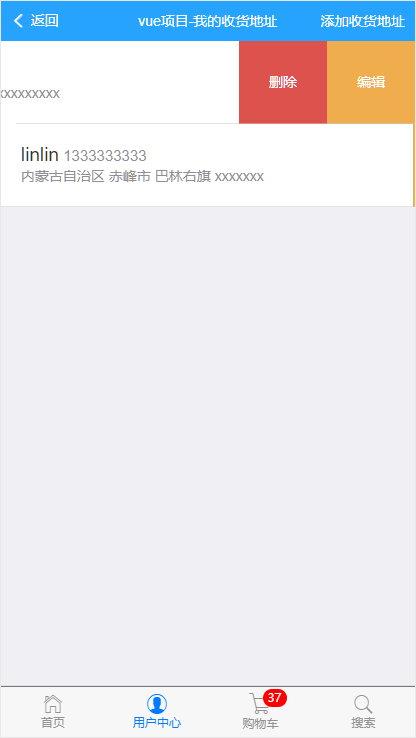
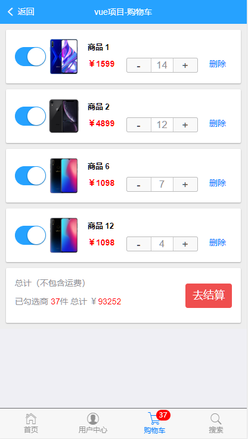

# vue商城项目

## .gitignore 项目的忽略文件

## LICENSE 开源协议的异同点 https://www.zhihu.com/question/19568896  

## 用传统的方式将修改后的代码上传到 github

1. 命令行  
    1. git add . 
    2. git commit -m "提交信息"
    3. 使用git push  // 上传

## 如果本项目有幸被您下载， 切记将ajax请求根域名修改成本地电脑对应ip 在 main.js 中修改 ，并前值 vue-cms-node 仓库中 下载对应的后台代码

```js
axios.defaults.baseURL = 'http://192.168.1.107/'
```

## 制作首页App组件

1. 完成了Header区域，使用是Mint-Ui 中的Header组件
2. 制作底部的 Tabbar 区域， 使用的MUI中的Tabbar.html
    1. 在制作底部的时候，因为有一个字体图标是在扩展图标中，因此需要导入对应的css样式，和字体图标
3. 要在中间区域 放置一个router-view 在展示路由匹配到的组件
  
## 改造 tabbar 为 router-link

## 设置高亮

## 点击tabbar 中的路由链接 展示对应的组件

## 制作首页轮播图 布局

1. 获取数据 使用 axios
2. 使用axios 获取数据  
3. 获取到的数据保存到data上
4. 使用v-for循环渲染页面 每个item 项

## 改造9宫格的样式

## 改造新闻资讯 路由链接

## 新闻资讯页面制作

1. 绘制界面 使用MUI中的 media-list.html
2. 使用 axios 获取数据
3. 渲染真实数据
    1. 使用moment插件格式化时间

## 实现 新闻列表资讯列表 点击跳转到新闻详情

1. 吧列表中的每一个项改造成router-link 同时在跳转的时候应该提供唯一的id标识符
2. 创建新闻详情的组件页面  newsInfo.vue
3. 在路由模块中将新闻详情的路由地址和组件页面对应起来

## 使用mint-ui `LoadMore` 组件实现上拉加载下拉刷新

 1. 做法 同下 设置高度时可以直接采用视口单位 `vh` 为其父容器设置高度

## 实现新闻详情的页面布局 再请求数据

## 单独封装一个comment.vue子组件

1. 先创建单独的一个comment.vue组件模板
2. 在需要使用comment组件的页面先手动的导入comment组件
    + `import comment from './comment.vue'`
3. 在父组件中使用 `components` 属性将刚刚到导入的comment组件，注册为自己的子组件
4. 将注册子组件时候的，注册名称以标签形式，在页面中引用

## 获取所有页面的评论显示到页面中

## 实现点击加载更多评论的功能

1. 为加载更多按钮，绑定点击事件，在事件中，请求 下一页数据
2. 点击加载更多，让pageIndex++ 然后重新调用下this.getComments 从新获取最新的数据
3. 为了防止新数据 覆盖老数据的情况，我们在点击加载跟多的时候每当获取到新 数据应该让老数据保留  可以调用concat 的方法   衔接上新的数组 

## 将评论列表改造成下拉加载

1. 使用mint-ui 的lead-more 组件
2. 在使用mint-ui注意点  
3. 一定要为组件的父元素加上一个高度，能有效的避免，上拉未到底触发上拉事件，
    1. 在这采用在Vue实例生命周期函数 mounted (页面加载完成之后) 获取这个父容器的高度
    2. 获取这个高度公式: 页面视口高度 - 页面滚动到最低部视口顶部到父容器顶部的距离 - 底部的高度
    ` this.wrapperHeight = document.documentElement.clientHeight - this.$refs.wrapper.getBoundingClientRect().top-50;`
    3. 通过style 属性绑定的方式 设置样式
4. 父容器需要设置样式溢出滚动 `overflow: scroll`
5. `bottom-method` 属性 是用于绑定上拉加载事件
6. 在配置这个组件的对象中，需要配置auto-fill 属性为false   避免自动加载评论，填充容器
7. 在这个组件中，需要配置api `bottom-all-loaded` 这个api 是用来控制上拉事件是非启动，如果为`true` 是不会监听 上拉刷新事件，通过属性绑定，在Vue实例对象中绑定数据  根据服务端返回的数据来判断是否监听上拉刷新事件
8. 在上拉事件方法中 一定需要调用  `this.$refs.loadmore.onBottomLoaded();` 方法这是因为在加载数据后需要对组件进行一些重新定位的操作 列表底部的上拉刷新与之类似，

## 发表评论

1. 文本域做双向数据绑定
2. 校验数据的合法性
3. 使用vue.resource 发送请求 提交评论数据
4. 数据的展现，如果在使用去服务端获取数据的方式获取数据，那么原有的数据会被删除  只能展现第一屏的数据，可以根据提交的数据 拼接处一个对象，使用数组中unshift的方法加入到评论列表的数据中

## 改造图片分析 按钮为路由的链接并显示对应的组件页面

## 绘制图片列表 组件的页面结构并美化样式

1. 制作顶部的滑动条  
2. 制作图片列表

### 制作顶部滑动条的坑

1. 需要借用 MUI中的 tab-top-webview-main.html 代码段
2. 需要删除类 mui-fullscreen 这个类是全屏覆盖的类 需要取消
3. 滑动条无法进行滑动，通过官方文档，发现是一个js组件  需要初始化
    + 导入js文件
    + 调用官方提供的方式去初始化

    ```js
        mui('.mui-scroll-wrapper').scroll({
          deceleration: 0.0005 //flick 减速系数，系数越大，滚动速度越慢，滚动距离越小，默认值0.0006
        });
   ```

4. 我们在初始化滑动条的时候 导入了mui.js但是控制台报错: `'caller', 'callee', and 'arguments' properties may not be accessed on strict mode functions or the arguments objects for calls to them at Function.d.extend ` 
    + 经过合理的推测，原因可能是 mui.js 中用到了 'caller', 'callee' arguments' 但是在 vue-cli 中打包好的文件默认是启用严格模式， 所以这两者冲突了
    + 解决方案: 1. 禁用 min.js 中的非严格 模式的改掉，但是不现实 2. 把 vue-cli 打包时候的严格模式禁用;
    + vue-cli 中禁用严格模式的 方式 (修改mui的代码不能实现)

        ```js
          module.exports = {
          "presets": [
            '@vue/cli-plugin-babel/preset'
          ],
          "ignore":[  './src/assets/js/mui.js']
        }
        ```

5. 刚进入图片分享页面的时候，滑动条无法正常工作，经过我们认真的分享，发现，如果要初始化滑动条，必须等dom元素加载完毕，所以将初始滑动条的代码绑到 mounted 的生命周期函数中

6. mui中的坑   js跟.mui-tab-item 冲突 使 tabber 中的所有按钮 不能支持切换，需要修改类名   
7. 获取所有的分类并渲染分类列表

### 制作图片列表区域

1. 图片列表需要使用了懒加载 使用mint-ui 组件 `Lazy load`
2. 根据使用文档，尝试使用
3. 渲染图片列表数据

### 实现了图片列表的懒加载和样式美化

1. 如果直接使用官方文档上的方法  (在设置样式的时候 选择器应该选择 `img[lazy: loading]` 而不是 `image[lazy: loading]` )
2. 通过官方的方法 在加载的时候是没有css样式的  而官方也没有提供具体引用了哪些组件的样式  只能将mint-ui 全局加载

## 实现了 点击图片 跳转到图片详情页面

1. 在改造li成router-link 需要使用 tag属性 指定要渲染成那种元素

## 实现了详情列表的布局和美化  同时实现 获取图片详情页 获取数据和渲染数据

## 实现 图片详情中缩略图的功能

1. 使用插件 vue-preview 这个缩略图插件
2. 获取到所有的图片列表 将数据过载到 vue-preview 组件 slides 自定义属性 对应名称的data 上
3. 每个数据对象中必须有w 和h 属性
4. 这个组件 默认是有全屏 ，分享按钮 如果要关闭需要在将组件过载到 `Vue.use()` 时 为这个组件配置参数  

    ```js
        import VuePreview from 'vue-preview'
        //过载到vue中
        Vue.use(VuePreview, {
          captionEl: true, //图片标题打开
          fullscreenEl: false, // 关闭全屏按钮
          shareEl: false,// 分享小图标打开或者关闭
          tapToClose: true, //点击关闭功能
          // bgOpacity: 0.85, 设置设置背景 的透明度
        })
    ```

5. 在设置css样式时，需要将 `style` 标签中不能有 `scoped` 属性，因为是引用的组件 如果加上 `scoped` 属性 样式将不生效  
  
## 绘制商品列表

## 尝试在手机上 进行项目的调试

1. 处于同一个网络环境中 局域网 手机可以访问到电脑的ip
2. 打开项目中的package.json 文件 在dev 脚本中添加 --host 指令，把当前电脑中 wifi IP地址设置为 --host 的指令 
    + 如何查看自己电脑上所处的WiFi 地址 在cmd终端运行 `ipconfig` 查看无限网的IP地址

## 在手机调试上发现bug

1. 在手机浏览上访问时，首页的底部导航无显示 下划着上面元素覆盖到 时就会显示  确定原因 在做进场动画为了当心横向溢出问题设置了 `overflow-x: hidden;` 然而在 ios 端，纵向也会溢出隐藏，父容器的高度还未达到视口的高度，解决方法  设置和 `html body .app-container` 的高度为 100%  在安卓手机上没有这个问题

## 获取商品列表并渲染到页面上,并使用编程导航跳转页面 (这个功能vue-router 插件有帮我们提供)

## 绘制商品详情页面

1. 使用 mui 中的card样式
2. 获取商品列表上的 轮播图页面
3. 将首页中的轮播图改造成组件, 方便我们在商品列表中使用
4. 通过mui 的 `number-box` 组件渲染 数字选择框 (需要引入mui.js文件和初始化组件)
5. 获取这个页面需要的参数 并渲染页面上
6. 使用编程式导航 跳转图文介绍, 商品评论页面
7. 加入购物车动画  
    1. 因为是半场动画  所以不能直接在 css 中设置动画的参数 需要使用到 `transition` 元素的钩子函数
    2. 在加入购物结束的位置不一定   可能会因为设备的分辨率或者页面卷曲的高度不同而改变  所以不能直接在给定固定的值  需要通过分别获取元素到页面顶部之间的距离 `DOMObj.getBoundingClientRect()` 这一个方法获取DOM 元素到顶部的坐标   
    3. 需要给动画的钩子函数 分别设置 不透明度 `opacity` 进场初始值 跟动画结束的不透明度 否是会不显示动画

## 获取数字输入框组件的值

1. 在父组件定义一个获取数组选择框值的方法 并将这个值保存在父组件的data上
2. 将这个方法传递给子组件， 在 `input` 元素的 value属性 改变的时候调用， `change` 事件
3. 在子组件中将input中value 传改父组件  （dom） 操作

## 给子组件传递最大值（库存）

1. 使用直接给子组件传递数据的方式 发现传过去的值有可能是 `undefined`
    + 原因是 这个属性的来源是 一个异步的ajax请求 这个请求不确定在什么时候能完成，并将数据过载在data上  可能是在渲染页面之后才获取到， 如果是这种情况 传过去的是一个空对象的一个属性   所以是undefined, 而miu的数值选择框在 html 标签上设置 最大值的为 `undefined` 之后 再设置不会生效
    + 解决方法
        1. 可以监听父组件传过来的值 使用`watch` 监听属性变化函数
        2. 通过mui 官方文档了解js api手动设置最大值 `mui(Selector).numbox().setOption('max',5)`

## 渲染图文介绍页面

## 渲染商品评论区域  

## 使用 vuex 插件实现 购物车数据各个组件之间共享

+ 有关购物车中的数据 是存储在 vuex 插件 的 `Store` 的实例对象中 跟本地存储中 `localStorage` 实现数据的持久化 

## 渲染购物车页面( 完成)

## 添加返回按钮 实现功能 （完成）

## 添加视频功能（完成）

## 添加用户功能（待续）

### 添加登录功能 默认用户名 lin 默认密码 123456 （完成）

### 添加用户页面 （完成）

### 添加收货地址功能（增删改查）（完成）

使用 v-distpicker 第三方组件实现地址选择器功能

### 添加收货地址组件与添加收货地址用户组件 公用一个自定义子组件 address_from 组件 （完成）

通过组件传递方法 参数的方法 对其 address_from 进行发送不同的ajax 请求, 

添加收货地址功能，添加成功后，可能会需要清空表单选项功能需要通过使用回调函数， 回调函数需用使用 band 方法绑定 this 的指向

### 添加用户修改个人信息表

1. 界面的渲染（完成）
2. 上传头像功能（完成）
 
    使用异步上传文件的方式，注意点 需要设置请求头的Content-type 为 multipart/form-data 使用；在file 表单元素上绑定 change 事件，当事件触发时，判断文件的类型大小是否符合要求，如果符合要求实例 FormData 对象，并使用 append 方法 加入 表单元素的 files\[0\];发送请求等待服务端的响应； 服务端做登录状态验证以及表单元素验证工作并文件保存，更新数据库操作；当服务成功时，再加上传的文件，将显示头像元素的src 修改成刚上传的图片，（使用 window.URL.createObjectUrl() 创建 刚刚上传文件的URL路径）
    
3. 修改各类信息（待续） 


## 改造购物车功能 将购物车中的数据存放在数据库中

### 将在 store 共享数据中 获取购物车数据进行改造

1. 初始化 store 公用的购物车状态，在App组件中

    1. 如果是没有登录， 获取本地数据，记录公用状态 isLogin
    
    2. 已经登录，通过服务端获取数据库数据，记录公用状态 isLogin

2. 购物车增删改查
    1. 在增删改成对应方法中，判断登录状态，如果是登录状态，需要发ajax请求，服务端也需要对数据库进行对应的增删改查
    
3. 登录功能的改进
    1. 登录时需用将本地的数据同步到服务端
    2. 服务器端需要对提交的购物车数据进行遍历 判断是否存在数据库中，存在 修改，不存在添加
    3. 通过服务器返回的 code 判断是否需要 发送ajax 请求 购物车获取数据，覆盖 store 中购物车状态

## 订单功能（待完成）

## 添加定位功能（待完成）

## 添加聊天功能（待完成）

## 支付功能（做不到）

## 效果呈现









